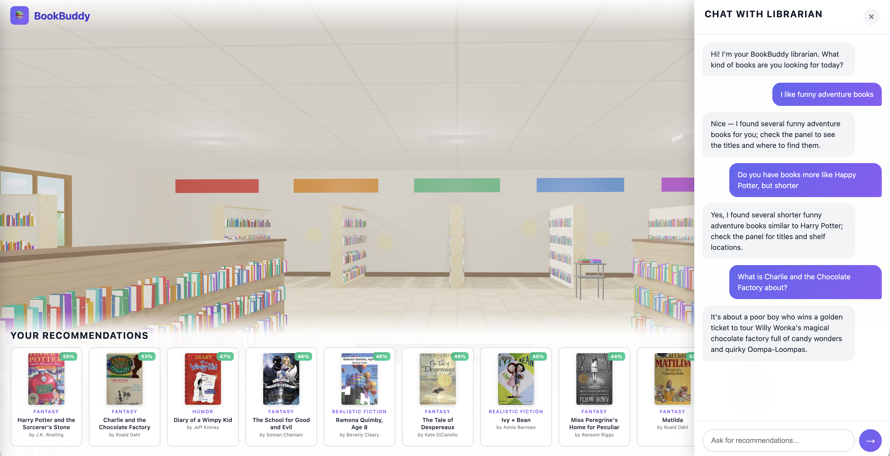

# BookBuddy: AI-Powered Library Recommendation System

A multi-modal recommendation system designed to increase student reading engagement through personalized AI recommendations, visual book discovery, and interactive 3D library exploration.



## Problem

School librarians rely on anecdotal data to recommend books. Students discover books through browsing shelves and seeing covers, not flat recommendation lists.

**BookBuddy solves this with:**
1. Visual Book Discovery: Students show book covers; AI finds similar books
2. Conversational AI Librarian: Natural language recommendations with personalized "book talks"
3. Virtual Library Tour: Interactive 3D library with AI-highlighted recommendations

## Architecture

```
┌───────────────────────────────────────────────────────────────────────┐
│                         BOOKBUDDY SYSTEM                              │
├───────────────────────────────────────────────────────────────────────┤
│  INTERFACE                                                            │
│  ┌─────────────────────────────────────────────────────────────────┐  │
│  │              3D Virtual Library (Three.js + Flask)              │  │
│  │  • Grade selector with reading level filtering                  │  │
│  │  • Chat panel with AI librarian (SSE streaming)                 │  │
│  │  • Visual book search (camera upload)                           │  │
│  │  • Interactive 3D bookshelves with recommendation hotspots      │  │
│  └─────────────────────────────────────────────────────────────────┘  │
├───────────────────────────────────────────────────────────────────────┤
│  AI LAYER                                                             │
│  ┌─────────────────────────────────────────────────────────────────┐  │
│  │                       LLM with Tool Calling                     │  │
│  │  • Semantic search with Sentence Transformers embeddings        │  │
│  │  • Query expansion (synonyms for better matching)               │  │
│  │  • Filtering ("not X", "must have Y")                           │  │
│  └─────────────────────────────────────────────────────────────────┘  │
├───────────────────────────────────────────────────────────────────────┤
│  TOOL LAYER                                                           │
│  ┌──────────────────┐  ┌──────────────────┐  ┌──────────────────┐     │
│  │      Content     │  │      Visual      │  │     Semantic     │     │
│  │    Similarity    │  │      Search      │  │      Search      │     │
│  └──────────────────┘  └──────────────────┘  └──────────────────┘     │
├───────────────────────────────────────────────────────────────────────┤
│  DATA LAYER                                                           │
│  ┌─────────────────────────────────────────────────────────────────┐  │
│  │                     Book Catalog (metadata)                     │  │
│  └─────────────────────────────────────────────────────────────────┘  │
└───────────────────────────────────────────────────────────────────────┘
```

## Features

| Component | Description |
|-----------|-------------|
| **LLM Chat** | GPT-5-mini with tool calling. Supports query expansion with synonyms, exclusions ("not Harry Potter"), and required keywords ("must have dragons"). |
| **Semantic Search** | Sentence Transformers (all-mpnet-base-v2) embeddings. Filters by reading level, then ranks by similarity. Supports length queries ("short books under 200 pages"). |
| **Visual Search** | Moondream vision (default) or GPT-5-mini analyzes book covers to extract title, author, and themes. Finds similar books using embeddings. |
| **Grade Filtering** | Books filtered to appropriate reading levels (K-2, 3-5, 6-8, 9-12) including adjacent levels. |
| **3D Library** | Three.js interactive library with recommendation hotspots and draggable camera. |
| **Book Catalog** | 100 children's books with custom descriptions, page counts, shelf locations, and availability. |

## Quick Start

```bash
# Create virtual environment and install dependencies
uv venv
source .venv/bin/activate  # or `.venv\Scripts\activate` on Windows
uv pip install -e .

# Generate book catalog (creates data/book_catalog.json)
# Embeddings are generated automatically on first server start
python bookbuddy/data_generator.py

# Run the 3D virtual library
python server.py
# Open http://localhost:5001
```

## Configuration

Copy `.env.example` to `.env` and add your API keys:

```bash
OPENAI_API_KEY="your-key"
MOONDREAM_API_KEY="your-key"  # Get from https://moondream.ai
VISION_PROVIDER="moondream"   # or "openai"
```

## Project Structure

```
bookbuddy/
├── server.py                   # Flask server for 3D library
├── pyproject.toml              # Project dependencies
├── bookbuddy/
│   ├── __init__.py             # Package exports
│   ├── recommendation_engine.py # Content-based similarity
│   ├── llm_agent.py            # LLM with tool calling
│   ├── visual_search.py        # Book cover analysis (Moondream/OpenAI) + semantic search
│   └── data_generator.py       # Book catalog with custom descriptions
├── scripts/
│   └── download_covers.py      # Utility to download book covers from Open Library
├── data/
│   ├── book_catalog.json       # Generated book catalog (100 books)
│   └── book_embeddings.pkl     # Cached semantic embeddings
├── static/
│   └── covers/                 # Book cover images
└── templates/
    └── virtual_library.html    # Three.js 3D library viewer
```
